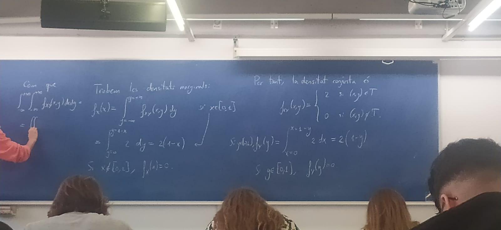
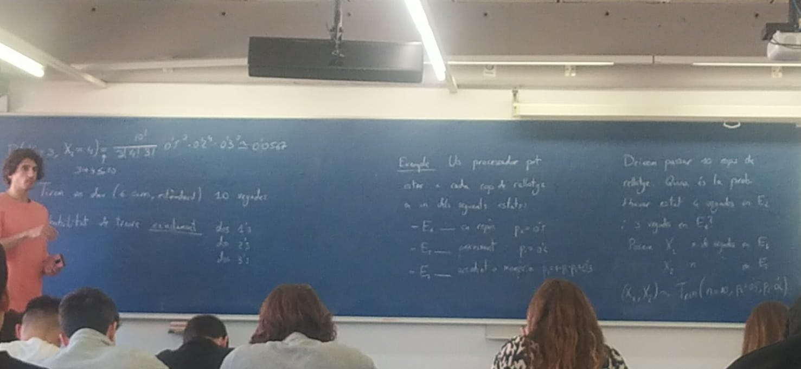

# 11.11.24

Recordem $(X_1, X_2)$ vector aleatori trinomial $((X_1, X_2) \sim \text{Trin}(n, p_1, p_2))$

$$
P(X_1 = n_1) = \dfrac{n!}{n_1! n_2! (n - n_1 - n_2)!} p_1^{n_1} p_2^{n_2} (1 - p_1 - p_2)^{n - n_1 - n_2} \quad \text{si} \quad n_1 + n_2 \leq n
$$

$$
P(X_1 = n_1, X_2 = n_2) = 0 \quad \text{si} \quad n_1 + n_2 > n
$$

### 3.1 Tirem un dau (6 cares, estàndard) 10 vegades

* Probabilitat da treure exactament dos 1's, dos 2's, dos 3's
* Ens interessen els resultats:
    * $R_1 \quad \text{ha sortit un 1, } \quad p_1 = \dfrac{1}{6}, \quad X_1 \text{ vegades que tenim } R_1$
    * $R_2 \quad \text{ha sortit un 2, } \quad p_2 = \dfrac{1}{6}, \quad X_2 \text{ vegades que tenim } R_2$
    * $R_3 \quad \text{ha sortit un 3, } \quad p_3 = \dfrac{1}{6}, \quad X_3 \text{ vegades que tenim } R_3$
    * $R_4 \quad \text{ha sortit un número de } \{4, 5, 6\}, \quad p_4 = \dfrac{1}{2}$

$$
P(X_1=2,X_2=2,X_3=2) = \dfrac{10!}{2! 2! 2! 4!} (\dfrac{1}{6})^2 (\dfrac{1}{6})^2 (\dfrac{1}{6})^2 (\dfrac{1}{2})^4 \simeq 0'02532
$$

## Vectors aleatoris continus

Direm que un vector aleatori és continu si cada component és ona v.a. contínua.

En concret, un vector aleatori $(X,Y)$ és continu si la distribució conjunta $F_{x,y}$ és una funció contínua.

Si la distribució conjunta $F_{X,Y}$ és diferenciable dues vegades, definim la **densitat de probabilitat conjunta** com

$$
f_{XY}(x,y) = \dfrac{\mathfrak{d}^2 F_{XY}}{\mathfrak{d}x \mathfrak{d}y} (x,y)
$$

També potem considerar les **densitats marginals.** Per exemple la densitat marginal da $X$ és

$$
f_x(x) = \int_{- \infty}^{+ \infty} f_{XY}(x,y) \mathcal{dy}
$$

## Relació entre la densitat conjunta i la distribució conjunta

$$
F_{XY}(x,y) = \int_{s=- \infty}^{s= x} \int_{t=- \infty}^{y} f_{XY}(s,t) \mathcal{ds,t} = P(X \leq x, Y \leq y)
$$

## Tropietats da la densitat conjunta

* $f_{XY}(x,y) \leq 0 \text{ per tant } (x,y) \in R^2$

## Exemple

Considerem el treangle T
amb vèrtex $(0,0),(1,0) \text{ i } (0,1)$. 
Conriderem el vector $(X,Y)$ que pren valors uniformement en T.

$$
f_{XY}(x,y) =
    \begin{cases}
        c \text{ si } (x,y) \in T\\
        0 \text{ si } (x,y) \not\in \\
    \end{cases}
$$

Fem servir que

$$
\int_{- \infty}^{+ \infty} \int_{- \infty}^{+ \infty} f_{XY}(x,y) \mathcal{dxdy} = 1
$$

per trobar $c > 0$

$$
\int_{x=0}^{x=1} \int_{y=0}^{y=1-x} c \quad \mathcal{dxdy} \rightarrow c=2
$$

## Exemple

$$
P(X< \dfrac{1}{2},Y> \dfrac{1}{2}) = \int_{x=0}^{x=1} \int_{y=0}^{y=1-x} 2 \quad \mathcal{dxdy} = \dfrac{1}{4}
$$

